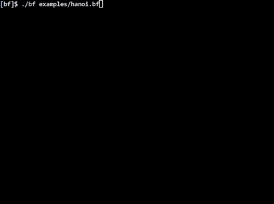
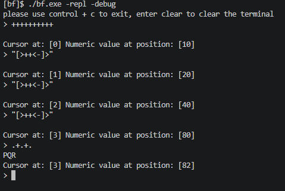
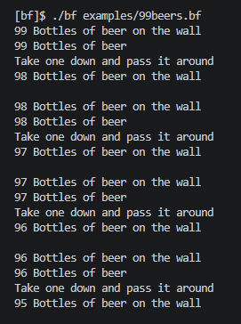

# Brainfuck Interpreter
A C++ implementation of Urban Muller's original language Brainfuck. Impemented almost completely from scratch by a guy with no experience writing anything compiler or interpreter adjacent. I mean... it's only a language with 8 key characters. 

For more information about what exactly "Brainfuck" is, please refer to this [Fireship video](https://www.youtube.com/watch?v=hdHjjBS4cs8) or this [wikipedia article](https://en.wikipedia.org/wiki/Brainfuck).

## Usage:
There are a couple of Brainfuck code examples in the [examples folder](./examples/)

- remember that windows environments will suffix executable files with `.exe`
```bash
./bf [bf_file]

# read bf directly from program arguments with -i
./bf -i "++++++++."

# run the REPL (Read, Evaluate, Print, Loop)
./bf -repl

# you may add the -debug flag to any operation to use debug mode
./bf examples/hanoi.bf -debug
```

### Additional information: 
- note that `-repl` mode will not output anything unless you use Brainfuck to output a character. use `-repl -debug` for a nicer REPL experience.
- You may use a file redirect to redirect a file contents in when using the repl. `./bf -repl < examples/99beers.bf`
    - Note that this behavior doesnt work in powershell and you must use a pipe instead `Get-Content examples/99beers.bf | ./bf -repl`
- When running with `-debug` on, it will generate a "Brainfuck" core dump of the entire array's snapshot in the file `bf.debug`. When running in `-repl` mode, it will update the debug file every cycle
    - Note that Brainfuck core dumps will shown in hexadecimal values
    - The `-debug` mode for `-repl` will be kind enough to print both the hexadecimal and decimal value of the cell your cursor is on every ccycle. 
## Examples:
- The interpreter running the Tower of Hanoi code 



- Example of running the REPL



- Example of just running a regular bit of Brainfuck



## Compiling
- Requirements
    - C++17 compatible compiler

### Using make
```bash
# Using make (defaults to using g++)
make 

# if you want to use clang instead
make CXX=clang++

# you may also make a release mode with -O3 optimzations for faster speeds
make release
```
### Compiling directly with the compiler
- Alternatively you can just compile them directly with the compiler
```bash
g++ -std=c++17 brainfuck.cpp -o bf     # gcc
clang++ -std=c++17 brainfuck.cpp -o bf # clang
```
- if you are brave enough to use MSVC
- open developer powershell or cmd
- type in:
```powershell
cl -std=c++17 brainfuck.cpp -o bf.exe
```

